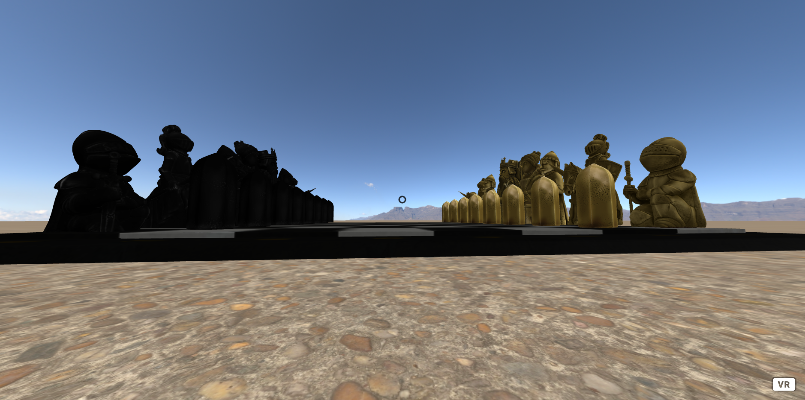

# Experiencia A-frame

Esta experiencia consiste en un tablero de ajedrez en gisgante con piezas que al mirar con el cursor empiezan una animación de agrandarse y encogerse y al clicarlas o pulsar el botón del mando de las gafas, desaparecen.

### Componentes utilizados

* aframe-physics. Permite atribuir físicas simples a las entidades de aframe.
* aframe-animation. Permite animar las entidades de aframe cambiando sus propiedades.
* controller-listener. Registra los movimientos de los mandos.
* player-move. Registra el movimiento en VR.
* raycaster-extras. Detecta con un rayo la trayectoría a la que apunta el mando de VR.

La ventaja principal de WebXR es la adaptabilidad que tiene a la hora de poder utilizar la aplicación en distintos dispositivos.

He efectuado pruebas en VR, PC y móvil
